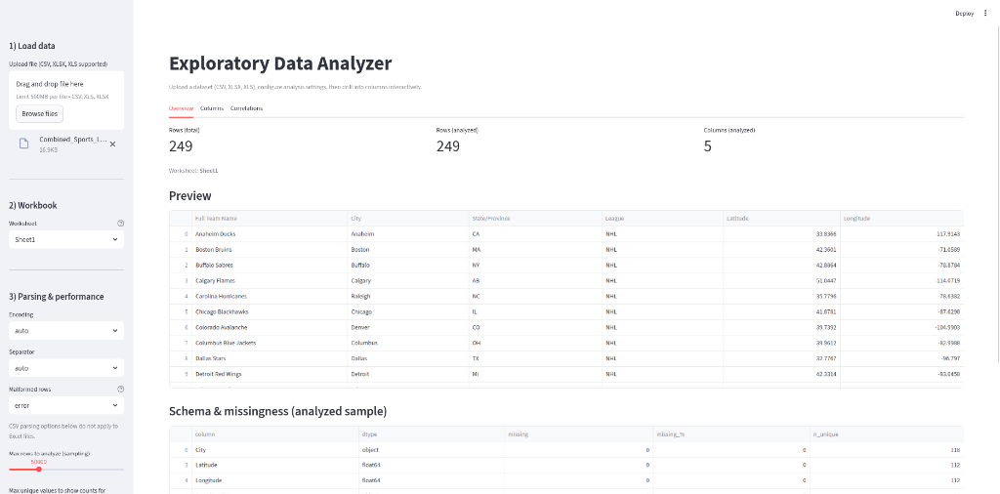

# Exploratory Data Analyzer

An interactive exploratory data analysis (EDA) web app built with **Streamlit**.
Upload a CSV or Excel file and get an instant profile of your data: schema,
missingness, per-column statistics, distributions, comparisons, and correlations.



*The Overview tab: row/column metrics, a data preview, and per-column schema
& missingness — here analyzing a 249-row sports teams Excel workbook.*

## Features

- **File upload** — CSV, XLSX, and XLS support. For Excel workbooks, pick the
  worksheet to analyze and set the header row to skip title/banner rows.
- **Parsing controls** — selectable encoding and delimiter ("auto" sniffs the
  delimiter and falls back to latin-1 for non-UTF-8 files), plus a
  "skip malformed rows" fallback for broken CSVs (retries with the Python
  engine and `on_bad_lines='skip'`).
- **Sampling** — large files are sampled (1k–200k rows, configurable) to keep
  the UI fast; total vs. analyzed row counts are always shown.
- **ID-like column detection** — heuristics (column name patterns, uniqueness
  ratio for non-float dtypes, UUID-shaped values) auto-exclude identifier
  columns, with an override to force-include them back.
- **Overview tab** — row/column metrics, 200-row preview, per-column dtype /
  missing % / unique counts (exportable as CSV), and the auto-exclusion
  report.
- **Columns tab** — drill into any column:
  - Numeric: percentile summary and a histogram with adjustable bins.
  - Categorical/text: string-length stats, top-K value counts table and bar
    chart, optional full value-counts dump (capped at 50k unique values).
  - Datetime: min/max/range summary and a rows-over-time chart with automatic
    granularity (day/week/month/year).
  - Compare against a second column: scatter plot + Pearson r (numeric ×
    numeric), box plot by category (numeric × categorical), or crosstab
    (categorical × categorical).
  - Column search, type-group filter, and favorites.
- **Correlations tab** — Pearson / Spearman / Kendall heatmap plus a ranked
  "column vs. everything" table. Cached and recomputed on demand
  ("Re-run correlations" button) or automatically when the config changes.

## Requirements

- Python **3.11+** (the `numpy==2.4.1` pin requires it) — or just use Docker.
- Dependencies are pinned in [`requirements.txt`](requirements.txt).

## Run locally

```bash
python3.11 -m venv .venv
source .venv/bin/activate
pip install -r requirements.txt
streamlit run app/app.py --server.port=8501
```

Then open <http://localhost:8501>.

## Run with Docker

```bash
docker compose up --build -d
```

The container listens on `127.0.0.1:8501` (localhost only) and includes a
healthcheck on `/_stcore/health`, a non-root user, `no-new-privileges`, and
rotated JSON logs.

**Note:** `docker-compose.yml` attaches to an **external** Docker network named
`website-network` (intended for a shared reverse proxy). Create it once if it
doesn't exist:

```bash
docker network create website-network
```

Or remove the `networks:` blocks if you don't need it.

### Optional: Cloudflare Tunnel

A `cloudflared` service is included but disabled by default (compose profile
`tunnel`). To expose the app on the internet:

1. Create a managed tunnel in the Cloudflare Zero Trust dashboard and copy its
   token into `CLOUDFLARE_TUNNEL_TOKEN` in `.env`.
2. In the tunnel's public hostname settings, point it at
   `http://eda-app:8501` (both containers share `website-network`).
3. Start it:

   ```bash
   docker compose --profile tunnel up -d
   ```

## Configuration

Copy `.env.example` to `.env` if needed. Variables:

| Variable                  | Purpose                                                              |
| ------------------------- | -------------------------------------------------------------------- |
| `CLOUDFLARE_TUNNEL_TOKEN` | Managed-tunnel token. Only used by the optional `tunnel` profile.    |

## Project structure

```
.
├── app/
│   └── app.py            # Streamlit application (all UI + analysis logic)
├── tests/
│   └── test_app.py       # pytest + streamlit AppTest regression suite
├── Dockerfile            # python:3.11-slim image, non-root user, port 8501
├── docker-compose.yml    # app + optional cloudflared (tunnel profile)
├── requirements.txt      # fully pinned runtime dependencies
├── requirements-dev.txt  # adds pytest for the test suite
├── .env                  # secrets (gitignored) — see .env.example
└── .env.example          # template for .env
```

## Tests

```bash
pip install -r requirements-dev.txt
pytest
```

The suite drives the real app through `streamlit.testing.v1.AppTest` and covers
CSV/encoding/delimiter edge cases, ID-column heuristics, the column-filter UI,
and the correlation-cache behavior.

## Known limitations

- ID-like detection is heuristic: ~unique integer/string columns and
  ID-flavored names (`*_id`, `uuid`, `token`, `*_key`, …) are auto-excluded.
  False positives can be restored via **Force-include**.
- Correlations are cached deliberately for speed. If you change exclusions or
  sampling without recomputing, the app prompts you to **Re-run correlations**
  rather than showing stale numbers.
- The "Datetime" column group uses type inference on a 200-value sample, so
  exotic date formats may be classified as text.
- Streamlit's upload limit is raised to 500 MB; larger files need CLI
  overrides (`--server.maxUploadSize`).

## License

[MIT](LICENSE)
